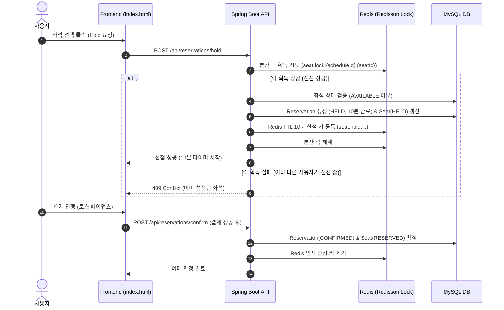

# BookWithTicket (도서 & 공연 티켓 통합 플랫폼)

> **"원작 소설을 읽고, 감동을 무대에서 만나는 원스톱 문화 예술 통합 예매 서비스"**  
> BookWithTicket은 도서 커머스와 실시간 공연 티켓팅 시스템을 상호 연동하고, 대규모 트래픽 환경에서의 동시성 제어 및 실시간 좌석 상태 동기화를 제공하는 엔터프라이즈급 웹 애플리케이션입니다.

---

## 주요 기술적 특징 (Technical Highlights)

### 1. Redis & Redisson 분산 락을 활용한 초고속 동시성 제어
- **대규모 동시 좌석 선점 방어**: 티켓 오픈 시 수천 명의 사용자가 동일한 좌석을 동시에 클릭하더라도, Redisson 분산 락(`seat:lock:{scheduleId}:{seatId}`)을 통해 **정확히 1명의 요청만 선점 처리**하고 나머지는 안전하게 409 Conflict 처리.
- **10분 자동 임시 선점 (TTL)**: Redis Key 만료(10분) 및 Spring Scheduled 스케줄러를 결합하여 결제 미완료 시 좌석 자동 반환.

### 2. KOPIS(공연예술통합전산망) OpenAPI 2단계 실시간 수집 엔진
- **1단계 (목록 수집)**: 공연 기본 메타데이터(장르, 공연명, 공연장, 기간, 포스터) 실시간 검색 및 수집.
- **2단계 (시설 및 객석 상세 파싱)**: 공연장 시설 고유 ID(`fcltyId`)를 연계 조회하여 실제 객석 수(`seatscale`)를 추출하고, 대규모 섹터별 좌석(VIP/R/S/A) 및 회차 일정을 **Batch Insert로 자동 생성**.

### 3. 도서 - 공연 양방향 크로스 연동 (Cross-Domain Linking)
- **원작 도서 상세 페이지** -> 연동된 뮤지컬/연극 공연 예매 바로가기 배너 제공
- **공연 상세 페이지** -> 원작 도서 상세 페이지 바로가기 연동
- **메인 페이지 통합 실시간 검색**: 키워드 하나로 도서 DB와 공연 DB를 동시 검색하여 통합 결과 표출.

### 4. 토스 페이먼츠 (Toss Payments) 실시간 결제 & 장바구니 통합
- 도서 상품 및 공연 좌석에 대한 통합 장바구니 관리
- 토스 페이먼츠 결제 위젯 연동 (결제 검증, 자동 확정, 주문/예매 상태 실시간 동기화)

### 5. 도서 및 공연 평점 & 리뷰 시스템
- 사용자별 1~5점 별점 평가 및 후기 작성
- 실시간 평균 평점 및 리뷰 수 자동 집계, 본인 작성 리뷰 삭제 권한 관리

---

## 기술 스택 (Tech Stack)

| 구분 | 기술 스택 |
|---|---|
| **Backend** | Java 17, Spring Boot 3.x, Spring Data JPA, Spring Security, JWT |
| **Concurrency & Cache** | Redis, Redisson (Distributed Lock), StringRedisTemplate |
| **Database** | MySQL 8.0, Hibernate |
| **External API** | KOPIS OpenAPI (공연예술통합전산망), Aladin OpenAPI (도서), Toss Payments API |
| **Frontend** | HTML5, CSS3, JavaScript (ES6+ Vanilla), Fetch API |
| **Build & Test** | Gradle, JUnit 5, AssertJ, Mockito |

---

## 시스템 아키텍처 & 좌석 예매 플로우



---

## 프로젝트 패키지 구조

```
src/main/java/com/example/bookwithticket/
├── book/                           # 도서 도메인 (도서 조회, 도서 리뷰, 알라딘 연동)
├── domain/
│   ├── performance/                # 공연 도메인 (공연, 회차, KOPIS OpenAPI 수집, 공연 리뷰)
│   └── reservation/                # 예매 도메인 (좌석, 예매 생명주기, Redis 분산락 동시성 제어)
├── member/                         # 회원 도메인 (인증/인가, JWT, 마이페이지)
├── order/                          # 주문 도메인 (도서 주문, 배송 관리)
├── cart/                           # 장바구니 도메인 (도서 및 공연 티켓 통합 장바구니)
├── payment/                        # 결제 도메인 (토스 페이먼츠 연동 및 검증)
└── global/                         # 공통 유틸, 예외 처리(BusinessException), 베이스 엔티티
```

---

## 빠른 시작 가이드 (Quick Start)

### 1. 환경 설정 (application.yml)
- MySQL 및 Redis 실행 상태를 확인합니다.
- `src/main/resources/application.yml` 설정 확인:
  - MySQL: `localhost:3306/bookwithticket`
  - Redis: `localhost:6379`

### 2. 프로젝트 실행
```bash
./gradlew bootRun
```

### 3. 접속 URL
- **메인 포털**: `http://localhost:8080/mainpage.html`
- **공연 예매 & 좌석 선점**: `http://localhost:8080/index.html`
- **도서 목록**: `http://localhost:8080/books.html`
- **통합 장바구니**: `http://localhost:8080/cart`
- **마이페이지 & 구매내역**: `http://localhost:8080/mypage.html`

### 4. 테스트 계정 (서버 기동 시 자동 시딩)
- **일반 사용자**: `test@example.com` / `password123`
- **관리자 계정**: `admin@example.com` / `password123`
